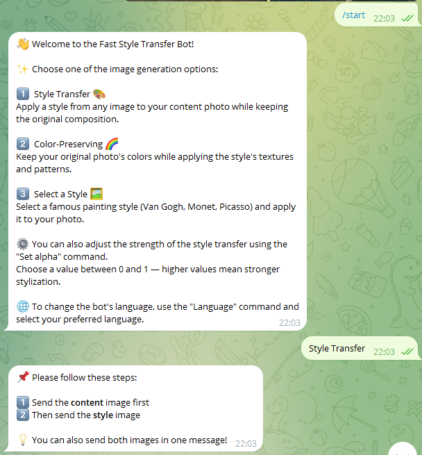
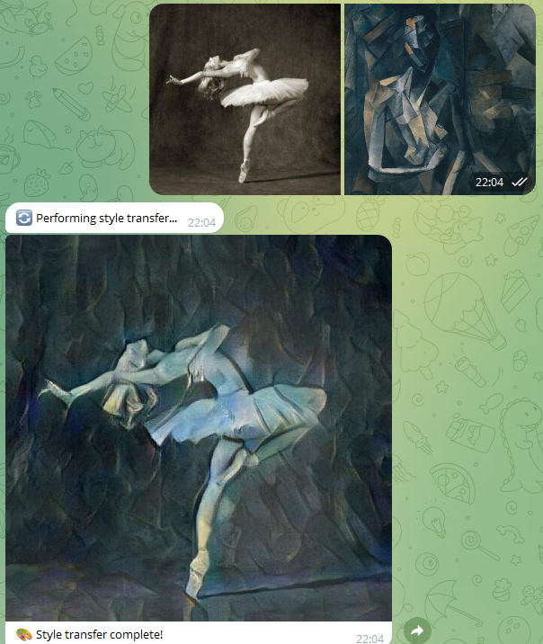
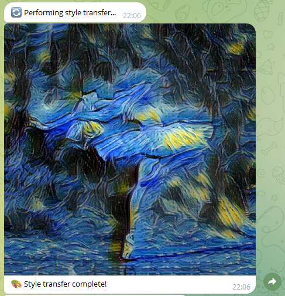

# DLS Style Transfer Telegram Bot

This repository hosts the code for a Telegram bot that performs image style transfer in real time. It leverages the Adaptive Instance Normalization (AdaIN) network introduced in ["Arbitrary Style Transfer in Real-time with Adaptive Instance Normalization"](https://arxiv.org/abs/1703.06868) by Xun Huang and Serge Belongie. The implementation builds upon an excellent PyTorch port of AdaIN, available [here](https://github.com/naoto0804/pytorch-AdaIN?tab=readme-ov-file). This project was developed as the final project of Part 1 of the [Deep Learning School](https://dls.samcs.ru/) course.

## Key Features
- **Telegram Bot Interface:** The model is integrated with the [python-telegram-bot](https://python-telegram-bot.org/) framework.
- **Lightweight and Efficient:** Utilizes the AdaIN model for rapid style transfer across any content–style image pair.
- **Asynchronous Processing:** Handles multiple users concurrently.
- **Content-Color Preservation:** Option to maintain the original colors of the content image during stylization.
- **Predefined Style Models:** Choose from fine-tuned style models based on Van Gogh, Monet, and Picasso paintings.
- **Adjustable Stylization Strength:** Control the intensity of the style transfer via the alpha parameter.
- **Bilingual Support:** The bot interface is available in both English and Russian.

## Examples

**Bot welcome message:**  


**Style transfer example:**  


**Style transfer with pretrained Van Gogh style:**  

## Project Structure

- `bot.py` — main Telegram bot script  
- `model/` — model architecture and related code  
- `model_weights/` — pretrained model weights files  
- `utils/` — utility functions  
- `tests/` — automated tests  
- `train/` — scripts to retrain or fine-tune the models if needed.  
- `test_images/` — sample images   

## Installation 
### Requirements
- python v3.10+
- pytorch v2.2+
- torchvision v0.21+
- pillow v11.2.1+
- python-telegram-bot v20+

### Initial Setup
The installation has been tested on **Ubuntu 22.04 LTS**.
1. Clone the repository:
   ```bash
   git clone https://github.com/NikDlv/DLS_style_transfer_tg_bot.git
   cd DLS_style_transfer_tg_bot
   ```

2. Create a `config.json` file in the project root directory with your Telegram bot API token:
   ```json
   {
     "telegram_token": "YOUR-TOKEN"
   }
   ```
   You can obtain your API token by creating a bot through the official Telegram bot manager [@BotFather](https://t.me/BotFather).

You can now proceed with either the standard installation or the Docker-based setup.
### Standard Installation

1. Install dependencies:
   ```bash
   pip install -r requirements.txt
   ```

2. Run the bot:
   ```bash
   python3 bot.py
   ```

### Docker Installation
This project uses an official NVIDIA CUDA Docker image based on Ubuntu 22.04. Depending on your system, you may need to adjust the `Dockerfile`.
1. Build the Docker image:
    ```bash
    sudo docker build -t dls-style-transfer-bot .
    ```

2. Run the container:
    ```bash
    sudo docker run --gpus all dls-style-transfer-bot
    ```
If you encounter issues with CUDA initialization, make sure the NVIDIA Container Toolkit is installed and properly configured. You can follow the instructions [here](https://docs.nvidia.com/metropolis/deepstream/dev-guide/text/DS_on_WSL2.html?_gl=1*8gi53*_gcl_au*OTA4NDA4NTYxLjE3MTEzMzAwMTI.#install-docker-engine-and-dependencies-inside-ubuntu) to install it.
## Usage
1. Start the bot by sending the `/start` command in the chat. You will see a keyboard with available options.
2. The bot automatically selects the language based on your Telegram settings. To change the language manually, use the `Language` option.
3. Choose a style transfer mode:
    - `Style Transfer`: Send two images — first your content image, then the style image. You will receive the stylized image in a few seconds.
    - `Color-Preserving`: Same as above, but the result retains the original colors of the content image.
    - `Select a Style`: Choose from predefined styles — Van Gogh, Monet, or Picasso. Then send a single content image.
4. You can set the `alpha` parameter (between 0 and 1), which controls the strength of the stylization.

## Additional Information

- The bot saves content and style images for each user in the `user_data/` folder.  
- The `train/` folder contains Python notebooks used for fine-tuning the model.
- Model behavior is covered with automated tests.
- Code quality is maintained with `Flake8`.

## License

This project is licensed under the MIT License - see the [LICENSE](LICENSE) file for details.
